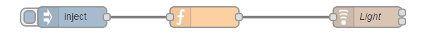
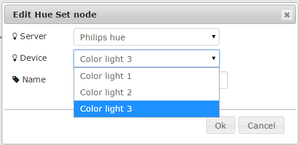

#Hue Node for Node RED
Control you Hue Lamps out of Node RED

#Installation
Just install this plugin to your Node Red installation by using npm: "npm install node-red-contrib-hue" in your Node Red root directory

#Usage
All you need to know is bundled with the installation: Just drag one of each of the hue nodes into your graph and read the manual displayed. Also no hassle to create a hue-user: just open the dialog, push the button on the bridge, select the hue server (is auto-discovered) and you are good to go.

#Example
```
[{"id":"1471048e.eb8efb","type":"Hue Set","deviceid":"","serverid":"","name":"Light","x":617,"y":232,"z":"4b831ffc.b47ce","wires":[[],[]]},{"id":"b2faa3bb.4d056","type":"function","name":"","func":"msg.payload={\n\t\t\t\"on\":[true],\n\t\t\t\"transitiontime\":[0],\n\t\t\t\"bri\":[1],\n\t\t\t\"rgb\":[75,75,255]\n\t\t}\nreturn msg;","outputs":1,"x":380,"y":232,"z":"4b831ffc.b47ce","wires":[["1471048e.eb8efb"]]},{"id":"ba018dd3.45fe7","type":"inject","name":"","topic":"","payload":"","payloadType":"date","repeat":"","crontab":"","once":false,"x":188,"y":232,"z":"4b831ffc.b47ce","wires":[["b2faa3bb.4d056"]]}]
```

#Screenshots

Example Flow:



Dialog:

